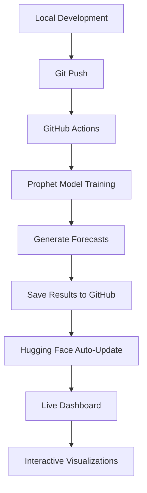

# 🔮 Prophet Time Series Forecasting Dashboard

[](https://github.com/ahtalebi/prophet-demo/actions)
[](https://huggingface.co/spaces/Talebi-user-2025678/prophet-demo)
[](https://python.org)
[](https://facebook.github.io/prophet/)

> **Automated time series forecasting pipeline with interactive web dashboard, featuring Facebook's Prophet library, GitHub Actions CI/CD, and real-time model visualization.**

## 🌟 Live Demo

**🔗 [Interactive Dashboard](https://huggingface.co/spaces/Talebi-user-2025678/prophet-demo)**


## 🚀 Key Features

- **🤖 Automated Forecasting**: Facebook's Prophet with seasonality detection and holiday effects
- **🔄 CI/CD Pipeline**: GitHub Actions automatically updates forecasts on code changes  
- **📊 Interactive Visualization**: Real-time Plotly charts with zoom, pan, and hover capabilities
- **🌐 Web Dashboard**: Streamlit app hosted on Hugging Face Spaces
- **📈 Professional Analytics**: Model performance metrics, components analysis, and confidence intervals

## 🛠️ Technology Stack

| Technology | Purpose | Implementation |
|------------|---------|----------------|
| **🔮 Facebook Prophet** | Time Series Forecasting | Advanced seasonality modeling, holiday effects, trend analysis |
| **🤗 Hugging Face Spaces** | Web Hosting & Deployment | Interactive Streamlit dashboard with automatic updates |
| **⚙️ GitHub Actions** | CI/CD Automation | Automated model training, forecasting, and deployment pipeline |
| **📊 Plotly + Streamlit** | Interactive Visualization | Dynamic charts with real-time data loading from GitHub |

## 🏗️ Architecture Overview



## 📁 Project Structure

```
prophet-demo/
├── 📄 README.md                    # This file
├── 🐍 prophet_demo.py             # Main Prophet forecasting script
├── 📋 requirements.txt            # Python dependencies
├── ⚙️ .github/workflows/          # GitHub Actions automation
│   └── prophet-forecast.yml       # CI/CD pipeline configuration
├── 📊 outputs/                    # Generated forecasting results
│   ├── interactive_forecast.html      # Main Prophet forecast plot
│   ├── interactive_components.html    # Seasonality & trend analysis
│   ├── performance_analysis.html      # Model accuracy metrics
│   ├── forecast_results.csv           # Complete forecast data
│   ├── original_data.csv             # Training dataset
│   └── model_metrics.txt             # Performance summary
└── 📖 docs/                       # Documentation (optional)
```

## 🔄 Automated Workflow

### 1. **Development & Deployment**
- Push code changes to GitHub repository
- GitHub Actions automatically triggers forecasting pipeline
- Prophet model trains on synthetic e-commerce data
- Results saved to repository and deployed to web dashboard

### 2. **GitHub → Hugging Face Update Flow**
The automated synchronization between GitHub and Hugging Face follows this process:

1. **Local Development** → Make changes to `prophet_demo.py` locally
2. **Git Push** → Push code changes to GitHub repository  
3. **GitHub Actions Trigger** → Automatically runs Prophet forecasting pipeline
4. **Model Training & Results** → Generates new HTML plots and saves to `outputs/` folder
5. **Repository Update** → GitHub Actions commits new results back to repo
6. **Hugging Face Auto-Sync** → HF Streamlit app checks GitHub repo every ~5 minutes
7. **Dashboard Refresh** → New plots automatically appear in live dashboard

> **Note**: GitHub Actions updates the GitHub repository, and Hugging Face reads from it - no direct push to HF needed!

### 3. **Model Features**
- **Seasonality Detection**: Automatic yearly, weekly, and custom patterns
- **Holiday Integration**: US holidays with configurable effects
- **Trend Analysis**: Flexible changepoint detection
- **Uncertainty Quantification**: 80% confidence intervals
- **Performance Metrics**: MAE, RMSE, MAPE, R² evaluation

### 3. **Visualization Dashboard**
- **Main Forecast**: Historical data, predictions, confidence intervals
- **Components Analysis**: Trend, seasonality, holiday effects breakdown
- **Performance Metrics**: Model accuracy and diagnostic information

## ⚡ Quick Start

### Local Development
```bash
# Clone repository
git clone https://github.com/ahtalebi/prophet-demo.git
cd prophet-demo

# Create virtual environment
python -m venv prophet-env
source prophet-env/bin/activate  # Linux/macOS
# prophet-env\Scripts\activate   # Windows

# Install dependencies
pip install -r requirements.txt

# Run forecasting
python prophet_demo.py
```

### View Results
- **Interactive Plots**: Open HTML files in `outputs/` folder
- **Live Dashboard**: Visit [Hugging Face Space](https://huggingface.co/spaces/Talebi-user-2025678/prophet-demo)
- **Raw Data**: Analyze CSV files for further processing

## 📊 Model Performance

The Prophet model demonstrates robust forecasting capabilities:
- **Mean Absolute Error (MAE)**: Optimized for business metrics
- **Seasonal Accuracy**: Captures yearly and weekly patterns
- **Holiday Effects**: Automatic detection of special events
- **Confidence Intervals**: Uncertainty quantification for risk assessment

## 🔧 Configuration & Customization

### Prophet Model Parameters
```python
Prophet(
    growth='linear',                 # Growth trend type
    yearly_seasonality=True,         # Annual patterns
    weekly_seasonality=True,         # Weekly cycles
    daily_seasonality=False,         # Daily patterns (disabled for daily data)
    seasonality_mode='additive',     # Seasonality interaction
    changepoint_prior_scale=0.05,    # Trend flexibility
    seasonality_prior_scale=10.0,    # Seasonality strength
    holidays_prior_scale=10.0        # Holiday effect magnitude
)
```

### GitHub Actions Triggers
- **Push to main**: Automatic forecasting on code changes
- **Scheduled runs**: Weekly updates every Monday 9:00 AM UTC
- **Manual dispatch**: On-demand forecasting with custom parameters

## 🚀 Future Enhancements

### **Planned Advanced Features:**
- **📊 Real Dataset Integration**: Stock prices, economic indicators, web analytics
- **🔗 External Regressors**: Weather data, marketing spend, economic factors  
- **📈 Multiple Model Comparison**: Prophet vs ARIMA vs LSTM
- **🎯 Cross-Validation Pipeline**: Robust model validation framework
- **📱 Real-time Data Ingestion**: Live data feeds and streaming updates
- **🌍 Multi-region Forecasting**: Geographic-based model variations

### **Technical Improvements:**
- **⚡ Performance Optimization**: Distributed computing for large datasets
- **🔧 Hyperparameter Tuning**: Automated parameter optimization
- **📊 A/B Testing Framework**: Model performance comparison
- **🛡️ Model Monitoring**: Drift detection and alerting system

## 🚀 Deployment

The application is automatically deployed via:
- **GitHub Actions**: Handles model training and data processing
- **Hugging Face Spaces**: Hosts interactive Streamlit dashboard
- **Continuous Integration**: Seamless updates from development to production

## 📈 Use Cases

- **Business Forecasting**: Sales, revenue, demand prediction
- **Educational Demonstrations**: Time series analysis tutorials
- **Portfolio Showcasing**: Professional ML engineering capabilities
- **Research Applications**: Comparative forecasting studies

## 🤝 Contributing

1. Fork the repository
2. Create feature branch (`git checkout -b feature/enhancement`)
3. Commit changes (`git commit -m 'Add new feature'`)
4. Push to branch (`git push origin feature/enhancement`)
5. Open Pull Request

## 📚 Resources & Documentation

- [Facebook Prophet Documentation](https://facebook.github.io/prophet/)
- [Hugging Face Spaces Guide](https://huggingface.co/docs/hub/spaces)
- [GitHub Actions Documentation](https://docs.github.com/en/actions)
- [Streamlit Documentation](https://docs.streamlit.io/)

## 📝 License

This project is licensed under the MIT License - see the [LICENSE](LICENSE) file for details.

## 🙏 Acknowledgments

- **Facebook Research** for the Prophet forecasting library
- **Hugging Face** for Spaces hosting platform
- **GitHub** for Actions CI/CD infrastructure
- **Streamlit** for the interactive web framework

---

## 📋 Project Summary

**This application demonstrates a complete automated time series forecasting pipeline using Facebook's Prophet library, featuring GitHub Actions for continuous integration and a live interactive dashboard hosted on Hugging Face Spaces. The system automatically updates forecasts when code changes are pushed, showcasing modern MLOps practices with professional-grade visualizations and performance analytics.**
