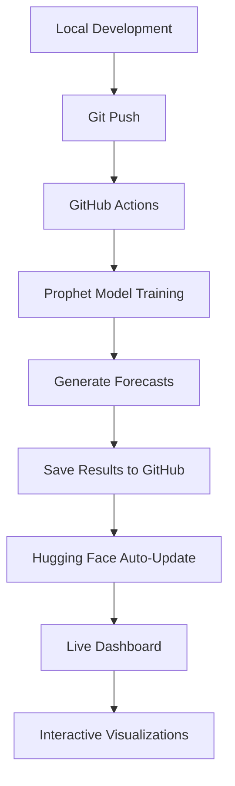

# Prophet Time Series Forecasting Dashboard

[](https://github.com/ahtalebi/prophet-demo/actions)
[](https://huggingface.co/spaces/Talebi-user-2025678/prophet-demo)
[](https://python.org)
[](https://facebook.github.io/prophet/)

> **Automated time series forecasting pipeline with interactive web dashboard, featuring Facebook's Prophet library, GitHub Actions CI/CD, and real-time model visualization.**

## Live Demo

**🔗 [Interactive Dashboard](https://huggingface.co/spaces/Talebi-user-2025678/prophet-demo)**


## 🚀 Key Features

- ** Automated Forecasting**: Facebook's Prophet with seasonality detection and holiday effects
- **CI/CD Pipeline**: GitHub Actions automatically dashboard on code changes  
- **Interactive Visualization**: Real-time Plotly charts
- ** Web Dashboard**: Streamlit app hosted on Hugging Face Spaces

## 🛠️ Technology Stack

| Technology | Purpose | Implementation |
|------------|---------|----------------|
| ** Facebook Prophet** | Time Series Forecasting | Advanced seasonality modeling, holiday effects, trend analysis |
| ** Hugging Face Spaces** | Web Hosting & Deployment | Interactive Streamlit dashboard with automatic updates |
| ** GitHub Actions** | CI/CD Automation | Automated model training, forecasting and deployment pipeline |
| ** Plotly + Streamlit** | Interactive Visualization | Dynamic charts with real-time data loading from GitHub |

##  Architecture Overview



## 📁 Project Structure

```
prophet-demo/
├── README.md                         # Project documentation
├── prophet_demo.py                   # Main Prophet forecasting script
├── app.py                            # Streamlit app 
├── requirements.txt                  # dependencies
├── .github/workflows/                # GitHub Actions automation
│   └── prophet-forecast.yml          # CI/CD pipeline configuration
├── outputs/                          # Generated forecasting results
│   ├── interactive_forecast.html     # Main Prophet forecast plot
│   ├── interactive_components.html   # Seasonality & trend analysis
│   ├── performance_analysis.html     # Model accuracy metrics
│   ├── forecast_results.csv          # Complete forecast data
│   ├── original_data.csv             # Training dataset
│   └── model_metrics.txt             # Performance summary
├── prophet-env/                      # Virtual environment .  local
└── .gitignore                        # Git ignore 
```

## 🔄 Automated Workflow

### 1. **Development & Deployment**
- Push code changes to GitHub repository
- GitHub Actions automatically triggers forecasting pipeline
- Prophet model trains on data
- Results saved to repository and deployed to web dashboard

### 2. **GitHub → Hugging Face Update Flow**
The automated synchronization between GitHub and Hugging Face follows this process:

1. **Local Development** → Make changes to `prophet_demo.py` locally
2. **Git Push** → Push code changes to GitHub repository  
3. **GitHub Actions Trigger** → Automatically runs Prophet forecasting pipeline
4. **Model Training & Results** → Generates new HTML plots and saves to `outputs/` folder
5. **Repository Update** → GitHub Actions commits new results back to repo
6. **Hugging Face Auto-Sync** → HF Streamlit app checks GitHub repo every ~5 minutes
7. **Dashboard Refresh** → New plots automatically appear in live dashboard

> **Note**: GitHub Actions updates the GitHub repository, and Hugging Face reads from it - no direct push to HF needed!

### 3. **Model Features**
- **Seasonality Detection**: yearly, weekly, and custom patterns
- **Holiday Integration**: US holidays with configurable effects
- **Trend Analysis**: Flexible changepoint detection
- **Uncertainty Quantification**: 80% confidence intervals
- **Performance Metrics**: MAE, RMSE, MAPE, R² evaluation

### 3. **Visualization Dashboard**
- **Main Forecast**: Historical data, predictions, confidence intervals
- **Components Analysis**: Trend, seasonality, holiday effects breakdown
- **Performance Metrics**: Model accuracy and diagnostic information

## ⚡ Quick Start

### Local Development
```bash
# Clone repository
git clone https://github.com/ahtalebi/prophet-demo.git
cd prophet-demo

# virtual environment
python -m venv prophet-env
source prophet-env/bin/activate  # Linux/macOS

# Install dependencies
pip install -r requirements.txt

# Run forecasting
python prophet_demo.py
```

### View Results
- **Interactive Plots**: Open HTML files in `outputs/` folder
- **Live Dashboard**: Visit [Hugging Face Space](https://huggingface.co/spaces/Talebi-user-2025678/prophet-demo)
- **Raw Data**: Analyze CSV files for further processing

##  Future Enhancements

### ** Advanced Features:**
- **Real Dataset Integration**
- **External Regressors**  
- **Multiple Model Comparison**: Prophet vs ARIMA vs LSTM
- **Cross-Validation Pipeline**
- **Live Data Ingestion**: Live data feeds and streaming updates
- **Multi-region Forecasting**

## Resources & Documentation

- [Facebook Prophet Documentation](https://facebook.github.io/prophet/)
- [Hugging Face Spaces Guide](https://huggingface.co/docs/hub/spaces)
- [GitHub Actions Documentation](https://docs.github.com/en/actions)
- [Streamlit Documentation](https://docs.streamlit.io/)

##  License

This project is licensed under the MIT License - see the [LICENSE](LICENSE) file for details.

##  Acknowledgments

- **Facebook Research** for the Prophet forecasting library
- **Hugging Face** for Spaces hosting platform
- **GitHub** for Actions CI/CD infrastructure
- **Streamlit** for the interactive web framework

---

## 📋 Project Summary

**This application demonstrates a complete automated time series forecasting pipeline using Facebook's Prophet library, featuring GitHub Actions for continuous integration and a live interactive dashboard hosted on Hugging Face Spaces. The system automatically updates forecasts when code changes are pushed, showcasing modern MLOps practices with professional-grade visualizations and performance analytics.**
